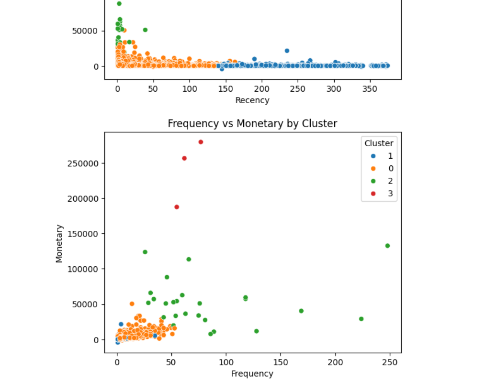

# ecommerce-customer-segmentation

Customer segmentation using RFM analysis and KMeans clustering with real e-commerce data.

## Project Summary

This project performs customer segmentation using **RFM analysis** (Recency, Frequency, Monetary) and applies **KMeans clustering** to group customers based on purchasing behavior. It helps businesses target different customer segments more effectively.

---

## Tools & Libraries Used
- Python (pandas, matplotlib, seaborn, sklearn)
- Jupyter Notebook
- RFM Scoring & Clustering
- GitHub for version control

---

## Dataset
The dataset is based on historical transactions from a UK-based online retailer.

---

## Key Visualizations

### Monthly Revenue

### Recency vs Monetary

### Frequency vs Monetary

### RFM Cluster Summary

---

## Cluster Insight

| Cluster | Recency | Frequency | Monetary      | Interpretation              |
|---------|---------|-----------|----------------|------------------------------|
| 0       | 40.05   | 5.52      | 1,781.12       | Average Customers            |
| 1       | 246.09  | 1.85      | 460.42         | Dormant/Churned Customers    |
| 2       | 6.16    | 82.72     | 52,112.12      | VIP / High-Value Customers   |
| 3       | 3.67    | 64.67     | 241,136.56     | Ultra Premium / Top 1%       |

---

## Output File
- [`customer_segments.csv`](customer_segments.csv): Final segmented data for marketing or business strategy.

---

## Conclusion
This segmentation allows targeted marketing, improved customer retention, and smarter business decisions. A great application of unsupervised learning in retail analytics.

---

> **Connect with me on [LinkedIn](https://www.linkedin.com/in/tirth-parikh-441653198/)**  
> **Project by Tirth Parikh**

